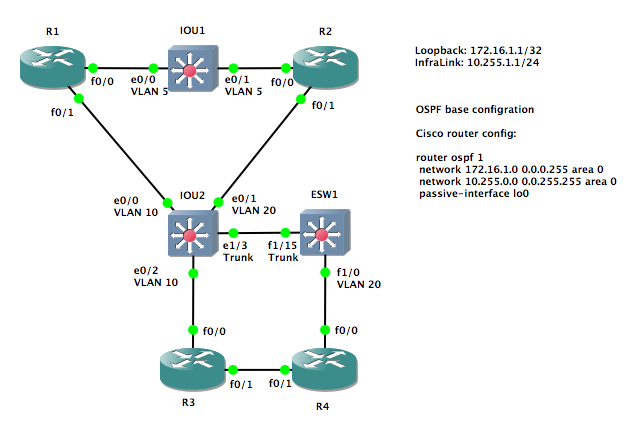

# Automatic IOS Base Configuration for GNS3

In GNS3 it's a bit boring to create the initial configuration
each time a new project is created. Therefore I'm trying to
automate that. `ios_base_config.py` is a Python 3 script, that
is called by the GNS3 GUI. It connects to the GNS3 server via
the API (<https://gns3-server.readthedocs.io/>), retrieves the
node and link information and uses that to create a base configuration
for the Cisco IOS router and switches. Then it connects to the
console of the virtual devices and enters the configuration.

On routers it configures Loopback0, the interfaces with an IP
address and description. On switches it configures the VLANs
and trunk or access mode on the interfaces. The changes are not
automatically saved, so if you're unhappy with them, simply
stop/start the nodes.

Initial configuration of a router is relative easy. You configure
the loopback interfaces, allocate IPs for all interfaces to other
routers, configure them and optionally add the base configuration
of a routing protocol.

For switches and interfaces from router to switches it gets a bit
more interesting. Looking at a topology doesn't tell you, what
VLANs are in use and what interfaces are access or trunk interfaces.
I've decided that this additional information should be added to the
link label. A sample topology could look like that:



Adding `vlan <number>` defines an access link with that VLAN,
adding `trunk` defines a trunk link. All switches interconnected
by trunks are forming a switch group. All access links in a
switch group with the same VLAN number are in the same IP network.
In my example IOU2 and ESW1 are forming one switch group. The
interfaces IOU2 e0/0 and e0/2 are within one IP network and
IOU2 e0/1 and ESW1 f1/0 are in another IP network. IOU1 creates
a switch group of it's own, with e0/0 and e0/1 within one IP net.

It's not possible to get the type of a node (router / switch /
firewall / end device) via the GNS3 API. Therefore "vlan" and
"trunk" interfaces automatically define that node as a switch.
So don't use these words on router links.

This way of using link labels to define the switching part of a
network doesn't allow all possible setups. But that isn't the
intension. It should be possible to automatically configure the
base setup of the inner part of a network. The access layer
towards the end devices and all non-basic stuff still needs
manual configuration.

The `Loopback: <IP network>` text in a note defines the first
loopback address, the next network is used for the loopback
interface of the next router and so on. Likewise `InfraLink:
<IP network>` is used to define the first IP address for the
infrastructure links (the links between the routers). Additionally
all text lines following `Cisco router config:` are added to the
configuration of the router. That way the basics of a routing
protocol can be easily added to all routers.

In the sample topology this configuration will be generated for R1:

```text
R1#configure terminal
Enter configuration commands, one per line.  End with CNTL/Z.
R1(config)#interface lo0
R1(config-if)# ip address 172.16.1.1 255.255.255.255
R1(config-if)#interface f0/0
R1(config-if)# description IOU1 e0/0 VLAN 5
R1(config-if)# ip address 10.255.1.1 255.255.255.0
R1(config-if)# no shutdown
R1(config-if)#interface f0/1
R1(config-if)# description IOU2 e0/0 VLAN 10
R1(config-if)# ip address 10.255.2.1 255.255.255.0
R1(config-if)# no shutdown
R1(config-if)#router ospf 1
R1(config-router)# network 172.16.1.0 0.0.0.255 area 0
R1(config-router)# network 10.255.0.0 0.0.255.255 area 0
R1(config-router)# passive-interface lo0
R1(config-router)#end
```

The switch IOU2 gets the following configuration:

```text
IOU2#configure terminal
Enter configuration commands, one per line.  End with CNTL/Z.
IOU2(config)#vlan 10
IOU2(config-vlan)#vlan 20
IOU2(config-vlan)#interface e0/0
IOU2(config-if)# description R1 f0/1
IOU2(config-if)# switchport access vlan 10
IOU2(config-if)# switchport mode access
IOU2(config-if)#interface e0/1
IOU2(config-if)# description R2 f0/1
IOU2(config-if)# switchport access vlan 20
IOU2(config-if)# switchport mode access
IOU2(config-if)#interface e0/2
IOU2(config-if)# description R3 f0/0
IOU2(config-if)# switchport access vlan 10
IOU2(config-if)# switchport mode access
IOU2(config-if)#interface e1/3
IOU2(config-if)# description ESW1 f1/15 Trunk
IOU2(config-if)# switchport trunk encapsulation dot1q
IOU2(config-if)# switchport mode trunk
IOU2(config-if)#end
```


## Manual Usage

You need a working Python 3 installation. Then download
ios_base_config.py to a directory of your choice.
Additionally we need gns3api.py, download it from
<https://git.b-ehlers.de/ehlers/gns3api-python> and save it in the
same directory. Then start the GNS3 GUI and open the project.
Now you can start ios_base_config.py:

```text
<path>ios_base_config.py [<GNS3 profile>] <project-name>
```


## Integration in GNS3 as a custom console command

First copy ios_base_config.py and gns3api.py to the `GNS3/tools`
directory.

Then create a custom console command:

**Windows**  
`cmd.exe /c %HOMEDRIVE%%HOMEPATH%\GNS3\tools\ios_base_config.py %i & pause`

**Linux**  
`xterm -e "sh -c 'cd; GNS3/tools/ios_base_config.py %i; read -p Close... var'"`

You can use a different terminal emulator by exchanging xterm to
gnome-terminal, mate-terminal, xfce4-terminal, ...

**Mac OS X**  
`osascript -e 'tell application "Terminal"' -e 'activate' -e 'do script "echo -n -e \"\\033]0;%d\\007\"; clear; PATH=\"" & (system attribute "PATH") & "\" GNS3/tools/ios_base_config.py %i"' -e 'end tell'`
